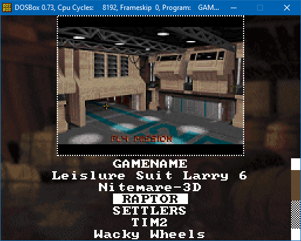
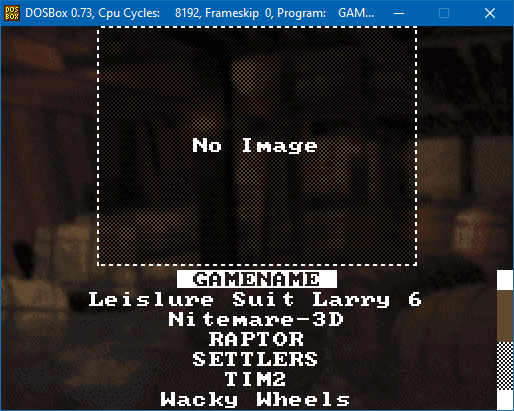

# DosGameMenu
the simplest graphical game menu for DOS

# Usage
the files BACK2.BMP, GAMES.EXE and the MENU.BAT should go in the folder that is the base for all games like for example C:\GAMES the program will enumerate all subfolders and add them as games

each game folder must contain a SSTHUMB.BMP file that must be a top down (or flipped) 160x120 256 color bitmap, where only the first 240 colors can be used for the thumbnail... the remaining 16 colors are reserved for the back2.bmp
inside each game folder you must have a PLAY.BAT that contains the command line to start to the game.

the SSTHUMB.BMP can be modified to contain a "full game name" (instead of regular folder name), for that you use the SETNAME / SHOWNAME tools
# Seting Names
to modify the visible name in the menu SSTHUMB.BMP is modified the 16 palette entry colors in the .bmp are used to store the name which have space for 47 characters (plus \0 terminator), however the program will only fit 32 characters.

syntax:

SHOWNAME <folder>

will show the name of the SSTHUMB.BMP stored at <folder> (don't include the final slash)

ex: SHOWNAME . 

display the name of the game stored in SSTHUMB.BMP at current folder

syntax:

SETNAME <folder> <name pattern>

is used to set the game title to be stored in the SSTHUMB.BMP stored at <folder> (don't include the final slash)
Due to limitations of qbasic COMMAND$() the whole name will would be UPPERCASE however the program will change the first character of each word to uppercase automatically, you can use _ instead of space to prevent the the character from being changed and you can prefix a char with ^ to force it to be uppercase

ex: SETNAME MDK M.^D.^K - THE_FINAL_EPISODE

will set the name of the SSTHUMB.BMP inside of the MDK folder to "M.D.K - The final episode"

# Compiling
this was made with qbasic 4.5 and will compile without needing any libraries
GAMES.BAS compiles the main program
SETNAME.BAS and SHOWNAME.BAS compiles the helper tools

# Extras
the BACK2.BMP can be modified to a different image, but it must be 256x192 with 256 colors... but it can only use colors from 240 to 255 (16 colors) the colors from 0 to 255, should be black.
in the BIN folder there's a GAMESASM.EXE that is the same program but written in assembly, it's faster and you can use it if you will use it with some very slow emulator (like the NDSx86 or the PS2 DOSBOX), when i find the source for that i will include it in this repository as well :)

